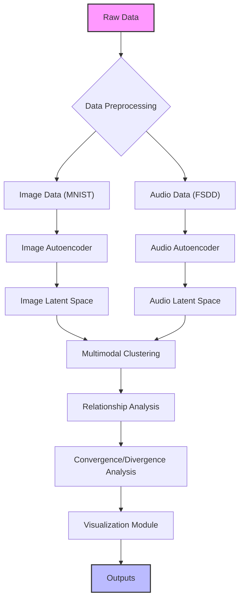
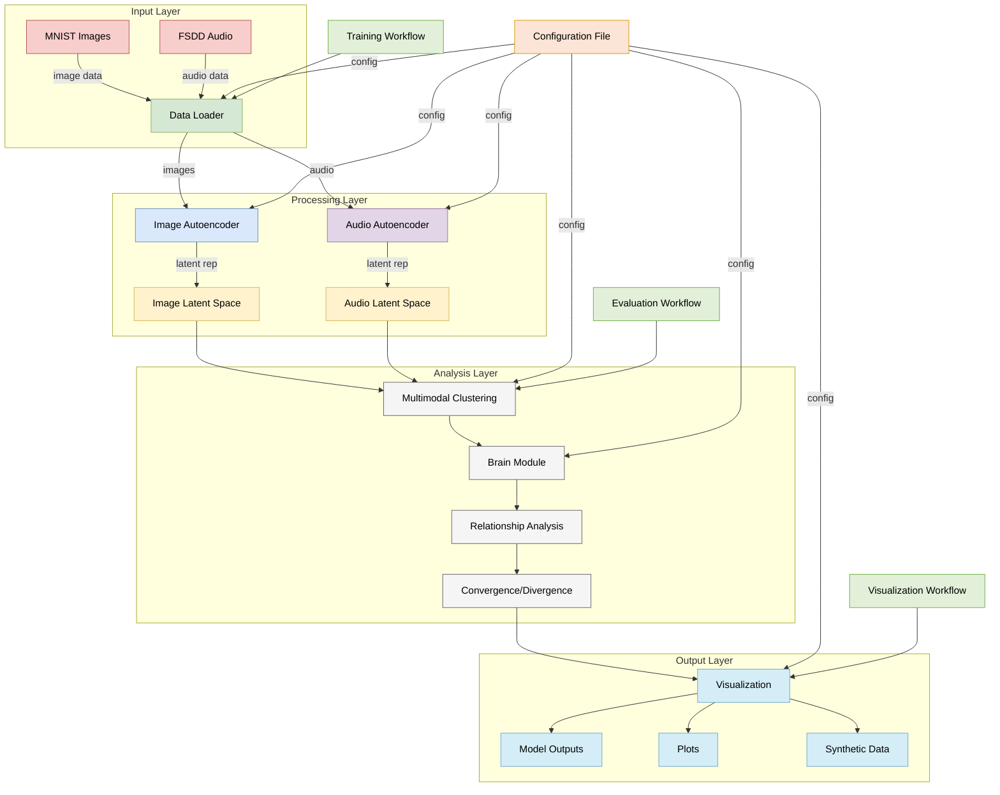

# Multimodal Generative Architecture

## Overview

This project implements a sophisticated system that processes both image (MNIST) and audio (FSDD) data using separate autoencoders, performs clustering on the latent representations, and analyzes relationships between modalities. The architecture is fully decoupled, allowing for independent processing of each modality while still enabling joint analysis.

## Features

- **Separate Processing Modules**: Independent modules for image and audio data processing
- **Unsupervised Learning**: No labeled data required for training
- **Advanced Encoding**: Autoencoder architectures for both image and audio data
- **Multimodal Clustering**: Clustering techniques for individual and joint modalities
- **Relationship Analysis**: Establishes one-to-one and one-to-many relationships between modalities
- **Convergence/Divergence Analysis**: Analyzes zones of similarity and difference between modalities
- **Visualization**: Comprehensive visualization of results including reconstructions, latent spaces, and clustering

## Architecture

The architecture consists of the following main components:

1. **Data Preprocessing and Encoding**
   - MNIST image dataset processing
   - FSDD audio dataset processing
   - Robust encoding generators for both datasets
   - Autoencoder architectures for each data type

2. **Clustering and Analysis Modules**
   - Visual clustering mechanism
   - One-to-one and one-to-many relationship tables
   - Brain module for intelligent processing
   - Config controller for dynamic parameter management
   - Convergence and divergence zone analysis

3. **Visualization**
   - Image and audio reconstruction visualizations
   - Latent space visualizations using t-SNE
   - Clustering result visualizations
   - Relationship heatmaps
   - Convergence and divergence analysis plots



## Directory Structure

```
Multimodal-Generative-Architecture/
├── config/
│   └── config.json
├── data/
│   ├── mnist/
│   └── fsdd/
├── modules/
│   ├── __init__.py
│   ├── brain_module.py
│   ├── config_controller.py
│   ├── data_loader.py
│   ├── image_autoencoder.py
│   ├── audio_autoencoder.py
│   ├── multimodal_clustering.py
│   ├── utils.py
│   └── visualization.py
├── outputs/
│   ├── models/
│   │   ├── image_autoencoder/
│   │   └── audio_autoencoder/
│   ├── clusters/
│   ├── synthetic/
│   └── plots/
├── main.py
├── train.py
├── evaluate.py
└── visualize.py
```
## Full Architecture Diagram



## Installation

1. Clone the repository:

```bash
git clone https://github.com/BLShaw/Multimodal-Generative-Architecture.git
cd Multimodal-Generative-Architecture
```

2. Create a virtual environment:

```bash
python -m venv venv
source venv/bin/activate  # On Windows: venv\Scripts\activate
```

3. Install the required packages:

```bash
pip install -r requirements.txt
```

## Usage

The project is designed to be run in three separate stages:

### 1. Training

Train the autoencoders and brain module:

```bash
python train.py --config config/config.json
```

This will:

- Download and preprocess the MNIST and FSDD datasets
- Train the image and audio autoencoders
- Train the brain module for multimodal processing
- Save all trained models and latent representations

### 2. Evaluation

Evaluate the trained models and perform clustering:

```bash
python evaluate.py --config config/config.json
```

This will:

- Load the trained models
- Perform clustering on individual modalities
- Perform joint clustering on multimodal data
- Establish relationships between modalities
- Analyze convergence and divergence zones
- Save clustering results and metrics

### 3. Visualization

Generate visualizations of the results:

```bash
python visualize.py --config config/config.json
```

This will:

- Load the trained models and results
- Generate reconstruction visualizations
- Visualize latent spaces using t-SNE
- Plot clustering results
- Visualize attention weights
- Generate synthetic samples

## Configuration

The system behavior can be customized through the `config/config.json` file:

```json
{
  "model": {
    "image_autoencoder": {
      "input_shape": [28, 28, 1],
      "encoder_layers": [128, 64, 32],
      "latent_dim": 16,
      "decoder_layers": [32, 64, 128],
      "learning_rate": 0.001,
      "batch_size": 32,
      "epochs": 50
    },
    "audio_autoencoder": {
      "input_shape": [8192],
      "encoder_layers": [1024, 512, 256],
      "latent_dim": 32,
      "decoder_layers": [256, 512, 1024],
      "learning_rate": 0.001,
      "batch_size": 16,
      "epochs": 50
    },
    "clustering": {
      "n_clusters": 10,
      "algorithm": "kmeans",
      "convergence_threshold": 0.001
    }
  },
  "data": {
    "mnist": {
      "resize_to": [28, 28],
      "normalize": true
    },
    "fsdd": {
      "sample_rate": 8000,
      "duration": 1.0,
      "normalize": true
    }
  },
  "paths": {
    "data_dir": "data",
    "output_dir": "outputs",
    "model_dir": "outputs/models",
    "cluster_dir": "outputs/clusters",
    "synthetic_dir": "outputs/synthetic",
    "plot_dir": "outputs/plots"
  }
}
```

## Results

The system generates several outputs:

1. **Trained Models**: Saved in `outputs/models/`
2. **Clustering Results**: Saved in `outputs/clusters/`
3. **Visualizations**: Saved in `outputs/plots/`
4. **Synthetic Samples**: Saved in `outputs/synthetic/`

Key metrics include:

- Silhouette scores for clustering quality
- Reconstruction losses for autoencoder performance
- Relationship matrices between modalities
- Convergence and divergence zone analysis

## Dependencies

- TensorFlow
- NumPy
- Scikit-learn
- Matplotlib
- Seaborn
- Librosa
- Soundfile
- Requests

See `requirements.txt` for the complete list.

## Contributing

1. Fork the repository
2. Create a feature branch:

```bash
git checkout -b feature/new-feature
```

3. Commit your changes:

```bash
git commit -am 'Add some new feature'
```

4. Push to the branch:

```bash
git push origin feature/new-feature
```

5. Open a Pull Request


## Acknowledgments

- [MNIST Dataset](http://yann.lecun.com/exdb/mnist/) - Yann LeCun
- [FSDD Dataset](https://github.com/Jakobovski/free-spoken-digit-dataset) - Jakobovski
- TensorFlow Team
- Keras Team
